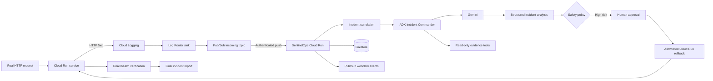

# SentinelOps

SentinelOps is an autonomous AI incident commander for detecting, investigating, remediating, verifying, and reporting service incidents.

Built for the **All Things Agentic Hackathon** in the **Taskmaster** category, SentinelOps combines Google Agent Development Kit (ADK), Gemini, Cloud Run, Cloud Logging, Pub/Sub, Firestore, and a safety-gated remediation executor.

> An incident is not resolved when the agent proposes a solution. It is resolved when the system proves that the service is healthy again.

## Core workflow

`Detect -> Investigate -> Decide -> Remediate -> Verify -> Report`

The live demo intentionally breaks a Cloud Run service, automatically detects the resulting HTTP 5xx signal, lets Gemini investigate the incident, pauses at a human approval gate, performs a real rollback to a known healthy Cloud Run revision, verifies recovery with a real health check, and writes a final incident report.

## What is implemented

- **Automatic failure detection** from Cloud Run request logs through Cloud Logging Log Router.
- **Authenticated Pub/Sub push ingestion** into the SentinelOps control plane.
- **Event correlation** to suppress repeated detector events during the same incident window.
- **Google ADK + Gemini investigation** with specialist agents and bounded read-only tools.
- **Structured incident analysis** including evidence, root-cause hypothesis, risk, remediation plan, and verification plan.
- **Human approval gate** for high-impact remediation.
- **Allowlisted live Cloud Run rollback** to an explicit target revision.
- **Real health verification** before an incident can be marked resolved.
- **Deterministic final report stage** after verification.
- **Firestore persistence** for incident state.
- **Pub/Sub workflow events** for control-plane observability.
- **Live dashboard** with current incidents, workflow progress, safety state, Node state, runtime mode, approval controls, execution controls, and verification controls.
- **SentinelOps Node** for local log, health, process, heartbeat, and normalized-event collection.

## Live architecture



The system is closed-loop: detection, investigation, action, and proof of recovery are part of one persisted incident lifecycle.

## Agent architecture

The ADK control plane uses an Incident Commander plus specialist agents for:

- log analysis;
- infrastructure context;
- code and deployment context;
- remediation planning;
- verification planning.

The commander performs investigation with tools first, then a separate formatter agent produces the structured `IncidentAnalysis` response. This avoids mixing tool/function-call output with the final schema contract.

## Safety model

SentinelOps does not give the model unrestricted infrastructure access.

Read-only inspection can run autonomously. High-impact remediation remains behind explicit policy checks and human approval. Live Cloud Run rollback is additionally constrained by:

- `SENTINELOPS_REMEDIATION_ALLOWED_SERVICES`;
- an explicit target revision;
- revision/service ownership validation;
- an explicit execution confirmation;
- real post-remediation health verification.

A blocked, rejected, or unverified action cannot be represented as a successfully resolved incident.

## Live demo flow

The primary demo service is `demo-api` with one known healthy revision and one intentionally broken revision.

1. Route traffic to broken v2.
2. Request `/health` and receive HTTP 500.
3. Cloud Logging emits a request log with `httpRequest.status >= 500`.
4. Log Router publishes the entry to Pub/Sub.
5. Pub/Sub pushes the event to SentinelOps.
6. SentinelOps correlates the event and creates one incident.
7. Gemini investigates and proposes rollback.
8. Human approval authorizes remediation.
9. SentinelOps routes 100% of Cloud Run traffic to the known healthy revision.
10. `/health` returns HTTP 200.
11. SentinelOps records `Verify` and `Report` and marks the incident `resolved`.

## Runtime stack

- Python 3.11+
- FastAPI
- Google Agent Development Kit (ADK)
- Gemini 3.5 Flash through Vertex AI ADC
- Google Cloud Run
- Cloud Logging / Log Router
- Pub/Sub
- Firestore
- Google Cloud Run Admin API
- GitHub API
- Docker

## Local setup

```bash
git clone https://github.com/EritikWoW/SentinelOps.git
cd SentinelOps
python3 -m venv .venv
source .venv/bin/activate
python -m pip install --upgrade pip
pip install -r requirements.txt
cp .env.example .env
```

Windows PowerShell:

```powershell
py -m venv .venv
.\.venv\Scripts\Activate.ps1
python -m pip install --upgrade pip
pip install -r requirements.txt
Copy-Item .env.example .env
```

The safe local default is deterministic demo mode:

```env
SENTINELOPS_MODE=demo
SENTINELOPS_STORE=memory
PUBSUB_ENABLED=false
```

Run:

```bash
uvicorn src.main:app --host 0.0.0.0 --port 8080 --reload
```

Verify:

```bash
curl http://localhost:8080/health
```

Expected:

```json
{"status":"ok","service":"sentinelops"}
```

Open the dashboard at `http://127.0.0.1:8080/`.

## Gemini / Vertex AI mode

Cloud Run uses Application Default Credentials through its service identity; no `GOOGLE_APPLICATION_CREDENTIALS` file is required in the container.

Typical runtime configuration:

```env
SENTINELOPS_MODE=gemini
GOOGLE_GENAI_USE_VERTEXAI=true
GOOGLE_CLOUD_PROJECT=YOUR_PROJECT_ID
GOOGLE_CLOUD_LOCATION=global
GEMINI_MODEL=gemini-3.5-flash
SENTINELOPS_STORE=firestore
FIRESTORE_DATABASE=(default)
PUBSUB_ENABLED=true
PUBSUB_DELIVERY_MODE=push
PUBSUB_TOPIC=sentinelops-incoming-events
PUBSUB_INTERNAL_TOPIC=sentinelops-internal-events
SENTINELOPS_REMEDIATION_ALLOWED_SERVICES=demo-api
```

The Cloud Run runtime service account needs only the permissions required by the configured deployment. Vertex AI access and Cloud Run remediation permissions should be granted to the runtime identity rather than embedded as static keys.

## Cloud Logging detector

The included setup script configures a project-level Log Router sink that exports new Cloud Run request logs with HTTP 5xx responses for the target service.

```bash
export GOOGLE_CLOUD_PROJECT=YOUR_PROJECT_ID
bash scripts/setup-cloud-logging-detector.sh
```

The detector uses a request-log filter equivalent to:

```text
resource.type="cloud_run_revision"
AND resource.labels.service_name="demo-api"
AND httpRequest.status>=500
```

The script also grants the sink writer identity Pub/Sub Publisher on the incoming topic.

## Cloud Run deployment

```bash
gcloud auth login
gcloud config set project YOUR_PROJECT_ID

gcloud run deploy sentinelops \
  --source . \
  --region=europe-west1 \
  --allow-unauthenticated
```

The public dashboard and API are served from the same Cloud Run service.

## Demo API

The repository includes `demo-api`, a deterministic Cloud Run target used to demonstrate rollback.

Healthy deployment:

```bash
bash scripts/deploy-demo-api.sh healthy
```

Broken deployment:

```bash
bash scripts/deploy-demo-api.sh broken
```

The broken revision returns HTTP 500 from `/health` and `/work`; the healthy revision returns HTTP 200.

## Incident lifecycle API

```text
POST /incidents                           manually create and analyze an incident
GET  /incidents?limit=25                  list recent incidents
GET  /incidents/{incident_id}             retrieve one incident
POST /incidents/{incident_id}/approval    approve or reject remediation
POST /incidents/{incident_id}/execute     execute approved allowlisted remediation
POST /incidents/{incident_id}/verify      record an explicit verification result
POST /incidents/{incident_id}/verify/health
                                         run real HTTP health verification
GET  /events                              inspect workflow events
POST /events                              ingest one normalized detector event
POST /events/{event_id}/replay            replay one recorded event
POST /nodes/heartbeat                     register a SentinelOps Node heartbeat
GET  /nodes                               list Node state
GET  /nodes/{node_id}                     inspect one Node
GET  /settings                            inspect safe runtime configuration
```

Mutating control-plane routes can be protected with `SENTINELOPS_AUTH_REQUIRED=true` and `SENTINELOPS_API_TOKEN`.

## Dashboard

The root dashboard is a live control-plane view rather than a static demo page. It reads runtime data from `/incidents`, `/settings`, and `/nodes`, auto-refreshes operational state, and exposes only actions supported by the backend.

The dashboard includes:

- active incident count;
- latest workflow progress;
- automation/safety state;
- incident evidence and root-cause hypothesis;
- approval and rejection controls;
- explicit Cloud Run rollback target revision + region;
- real health verification;
- workflow/event history;
- Node state;
- runtime mode/environment state;
- collapsible navigation.

Production settings are presented as read-only because durable Cloud Run configuration is deployment-managed.

## SentinelOps Node

Start a local Node with:

```bash
python -m src.node.agent --config node.yaml
```

The Node can monitor local logs, health endpoints, process state, and heartbeats and send normalized bounded evidence to the central control plane. It does not stream every log line to Gemini.

See [`docs/node.md`](docs/node.md) for the reproducible Node demo.

## Tests

```bash
python -m pytest -q
```

CI runs the automated test suite for pull requests.

## Project structure

```text
SentinelOps/
├── demo/                       # deterministic healthy/broken Cloud Run target
├── docs/                       # architecture and implementation notes
├── scripts/                    # cloud/bootstrap/detector/demo helpers
├── src/
│   ├── agents/                 # ADK commander and specialist agents
│   ├── models/                 # incident/event/settings contracts
│   ├── node/                   # SentinelOps Node
│   ├── policy/                 # safety policy
│   ├── services/               # stores, Pub/Sub, Cloud Run executor, verification
│   ├── web/                    # live dashboard
│   └── main.py                 # FastAPI control plane
└── tests/
```

## Hackathon proof points

SentinelOps demonstrates that an agentic incident-response system can go beyond recommendations while retaining explicit safety boundaries:

- **Real failure** — an actual Cloud Run revision returns HTTP 500.
- **Real event** — Cloud Logging and Pub/Sub create the incident automatically.
- **Real agent** — Google ADK + Gemini investigate the failure.
- **Real safety gate** — high-risk remediation stops for human approval.
- **Real action** — SentinelOps changes Cloud Run traffic to the approved healthy revision.
- **Real verification** — the service must return HTTP 200 before resolution.
- **Real report** — the completed workflow records a final incident report.

That closed loop is the core of SentinelOps.
