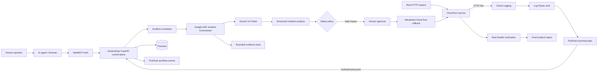

# SentinelOps

SentinelOps is an autonomous AI incident commander that detects, investigates, remediates, verifies, and reports service incidents through a safety-gated control plane.

> An incident is not resolved when the agent proposes a solution. It is resolved when the system proves that the service is healthy again.

Live demo: https://sentinelops-761693711271.europe-west1.run.app/

Public repository: https://github.com/EritikWoW/SentinelOps

## Hackathon submissions

SentinelOps is used in two separate 2026 hackathon submissions with different evaluation requirements.

### All Things Agentic Hackathon — Google

Category: **Taskmaster**

The All Things Agentic submission was built during the August 3–31, 2026 submission period as a complete autonomous operational workflow rather than a chatbot.

It satisfies the mandatory stack requirements with:

- **Gemini 3.5 Flash** through Vertex AI;
- **Google Agent Development Kit (ADK)**;
- **Google Cloud** services including Cloud Run, Cloud Logging, Pub/Sub, and Firestore.

The submitted workflow is:

`Detect -> Investigate -> Decide -> Remediate -> Verify -> Report`

The system receives a real Cloud Run HTTP 5xx signal, creates and correlates an incident, uses Gemini + ADK to investigate evidence, proposes a remediation, pauses at a human safety gate for high-impact actions, performs an allowlisted Cloud Run rollback, verifies recovery using a real HTTP health check, and only then marks the incident resolved.

The repository state used for the All Things Agentic submission is preserved on the branch:

`all-things-agentic-submission-2026`

That branch points to commit:

`49d5183cbacbd79b93c8869f0c1bc50be52293cf`

This frozen branch exists so the Google hackathon submission can be evaluated against the code state that existed before its submission deadline while development for the later WebMCP Challenge can continue independently.

### The WebMCP Challenge — OpenAI

SentinelOps existed before the WebMCP Challenge. The project was therefore **meaningfully extended with WebMCP after the WebMCP submission period began**, as required by the challenge rules.

The WebMCP extension adds a browser-native structured agent interface to the existing SentinelOps control plane without bypassing its backend safety model.

The complete distinction between pre-existing work and WebMCP work is documented in [`WEBMCP_CHALLENGE.md`](WEBMCP_CHALLENGE.md).

WebMCP work added for the challenge includes:

- browser-native registration through `document.modelContext.registerTool(...)`;
- eight bounded SentinelOps tools;
- read-only discovery and inspection operations;
- safety-gated remediation operations;
- WebMCP status in the live dashboard;
- runtime regression tests for tool registration and safety behavior;
- native Chrome WebMCP validation against the live Cloud Run deployment.

The WebMCP tools are:

Read-only:

- `sentinelops_list_incidents`
- `sentinelops_get_incident`
- `sentinelops_list_events`
- `sentinelops_list_nodes`

Controlled actions:

- `sentinelops_approve_remediation`
- `sentinelops_reject_remediation`
- `sentinelops_execute_remediation`
- `sentinelops_verify_recovery`

WebMCP is an interface layer only. Controlled tool calls still delegate to the same SentinelOps REST endpoints and backend policy checks used by the dashboard.

## Native WebMCP validation

The live SentinelOps deployment has been tested in Google Chrome with native WebMCP enabled.

Validation confirmed:

- `document.modelContext` is available;
- all eight SentinelOps tools are discoverable through the browser WebMCP API;
- `sentinelops_list_incidents` executes through `document.modelContext.executeTool(...)`;
- the tool returns live production incident data from SentinelOps;
- the live service `/health` endpoint returns HTTP 200;
- controlled remediation tools retain the same approval, execution, and verification gates as the backend.

This validates the full path:

`WebMCP-capable agent/browser -> document.modelContext -> SentinelOps WebMCP tool -> SentinelOps API -> live incident state`

For Chrome testing, use a WebMCP-capable Chrome build, enable WebMCP testing, restart the browser, and open the live SentinelOps URL.

Example discovery from DevTools:

```js
await document.modelContext.getTools()
```

Example read-only execution:

```js
const tools = await document.modelContext.getTools();
const tool = tools.find(t => t.name === "sentinelops_list_incidents");
await document.modelContext.executeTool(tool, "{}");
```

## Why WebMCP fits SentinelOps

Infrastructure incident response is a strong WebMCP use case because an agent should not need unrestricted cloud credentials or brittle DOM automation to operate an incident control plane.

SentinelOps exposes a small, structured capability surface directly from the web application. Agents can inspect incidents, evidence, events, and node state, then coordinate approved remediation through bounded tools.

This enables a human and an agent to collaborate on a real operational workflow while preserving deterministic backend safety controls.

Before WebMCP, an external agent would need custom API integration, browser automation, or direct infrastructure credentials. With WebMCP, the live web application itself declares the operations an agent is allowed to perform.

## Core workflow

`Detect -> Investigate -> Decide -> Remediate -> Verify -> Report`

The live demo intentionally breaks a Cloud Run service, automatically detects the resulting HTTP 5xx signal, lets Gemini investigate the incident, pauses at a human approval gate, performs a real rollback to a known healthy Cloud Run revision, verifies recovery with a real health check, and writes a final incident report.

## What is implemented

- Automatic failure detection from Cloud Run request logs through Cloud Logging Log Router.
- Authenticated Pub/Sub push ingestion into the SentinelOps control plane.
- Event correlation to suppress repeated detector events during the same incident window.
- Google ADK + Gemini investigation with specialist agents and bounded read-only tools.
- Structured incident analysis including evidence, root-cause hypothesis, risk, remediation plan, and verification plan.
- Human approval gate for high-impact remediation.
- Allowlisted live Cloud Run rollback to an explicit target revision.
- Real health verification before an incident can be marked resolved.
- Deterministic final report stage after verification.
- Firestore persistence for incident state.
- Pub/Sub workflow events for control-plane observability.
- Live dashboard with incidents, workflow progress, policy state, execution controls, verification controls, WebMCP state, and Node state.
- SentinelOps Node for local log, health, process, heartbeat, and normalized-event collection.
- Native WebMCP bridge exposing eight bounded tools.

## Architecture



The WebMCP layer does not replace the control plane. It exposes bounded operations from the web application while the API and backend policy remain authoritative.

## Agent architecture

The ADK control plane uses an Incident Commander plus specialist agents for:

- log analysis;
- infrastructure context;
- code and deployment context;
- remediation planning;
- verification planning.

The commander performs investigation with tools first, then a separate formatter agent produces the structured incident analysis response. This separates tool execution from the final schema contract.

## Safety model

SentinelOps does not give the model unrestricted infrastructure access.

Read-only inspection can run autonomously. High-impact remediation remains behind explicit policy checks and human approval.

Live Cloud Run rollback is constrained by:

- `SENTINELOPS_REMEDIATION_ALLOWED_SERVICES`;
- an explicit target revision;
- revision/service ownership validation;
- an explicit execution confirmation;
- real post-remediation health verification.

WebMCP controlled actions are subject to these same backend rules. Browser-side checks are defense in depth only; the server remains the security boundary.

A blocked, rejected, failed, or unverified action cannot be represented as a successfully resolved incident.

## Live demo flow

The primary demo service is `demo-api` with one known healthy revision and one intentionally broken revision.

1. Route traffic to broken revision.
2. Request `/health` and receive HTTP 500.
3. Cloud Logging emits a request log with `httpRequest.status >= 500`.
4. Log Router publishes the entry to Pub/Sub.
5. Pub/Sub pushes the event to SentinelOps.
6. SentinelOps correlates the event and creates an incident.
7. Gemini + ADK investigate and propose rollback.
8. Human approval authorizes the high-impact remediation.
9. SentinelOps routes 100% of Cloud Run traffic to the known healthy revision.
10. SentinelOps performs a real health verification.
11. `/health` returns HTTP 200.
12. SentinelOps records Verify and Report and marks the incident resolved.

A WebMCP-capable agent can inspect and coordinate this same workflow through the structured browser tools.

## Runtime stack

- Python 3.11+
- FastAPI
- Google Agent Development Kit (ADK)
- Gemini 3.5 Flash through Vertex AI ADC
- Google Cloud Run
- Cloud Logging / Log Router
- Pub/Sub
- Firestore
- Google Cloud Run Admin API
- WebMCP / `document.modelContext`
- JavaScript dashboard bridge
- GitHub API
- Docker

## Local setup / spin-up instructions

Clone the project:

```bash
git clone https://github.com/EritikWoW/SentinelOps.git
cd SentinelOps
```

Create a virtual environment and install dependencies:

```bash
python3 -m venv .venv
source .venv/bin/activate
python -m pip install --upgrade pip
pip install -r requirements.txt
cp .env.example .env
```

Windows PowerShell:

```powershell
py -m venv .venv
.\.venv\Scripts\Activate.ps1
python -m pip install --upgrade pip
pip install -r requirements.txt
Copy-Item .env.example .env
```

Safe local deterministic mode:

```env
SENTINELOPS_MODE=demo
SENTINELOPS_STORE=memory
PUBSUB_ENABLED=false
```

Run:

```bash
uvicorn src.main:app --host 0.0.0.0 --port 8080 --reload
```

Verify:

```bash
curl http://localhost:8080/health
```

Expected:

```json
{"status":"ok","service":"sentinelops"}
```

Open the dashboard at:

`http://127.0.0.1:8080/`

## Gemini / Vertex AI mode

Cloud Run uses Application Default Credentials through its service identity; no static Google credential file is required in the container.

Typical configuration:

```env
SENTINELOPS_MODE=gemini
GOOGLE_GENAI_USE_VERTEXAI=true
GOOGLE_CLOUD_PROJECT=YOUR_PROJECT_ID
GOOGLE_CLOUD_LOCATION=global
GEMINI_MODEL=gemini-3.5-flash
SENTINELOPS_STORE=firestore
FIRESTORE_DATABASE=(default)
PUBSUB_ENABLED=true
PUBSUB_DELIVERY_MODE=push
PUBSUB_TOPIC=sentinelops-incoming-events
PUBSUB_INTERNAL_TOPIC=sentinelops-internal-events
SENTINELOPS_REMEDIATION_ALLOWED_SERVICES=demo-api
```

The Cloud Run runtime identity should receive only the permissions required by the configured deployment.

## Cloud Logging detector

The setup script configures a project-level Log Router sink for new Cloud Run request logs with HTTP 5xx responses.

```bash
export GOOGLE_CLOUD_PROJECT=YOUR_PROJECT_ID
bash scripts/setup-cloud-logging-detector.sh
```

Representative filter:

```text
resource.type="cloud_run_revision"
AND resource.labels.service_name="demo-api"
AND httpRequest.status>=500
```

## Cloud Run deployment

```bash
gcloud auth login
gcloud config set project YOUR_PROJECT_ID

gcloud run deploy sentinelops \
  --source . \
  --region=europe-west1 \
  --allow-unauthenticated
```

The public dashboard and API are served from the same Cloud Run service.

## Incident lifecycle API

```text
POST /incidents
GET  /incidents?limit=25
GET  /incidents/{incident_id}
POST /incidents/{incident_id}/approval
POST /incidents/{incident_id}/execute
POST /incidents/{incident_id}/verify
POST /incidents/{incident_id}/verify/health
GET  /events
POST /events
POST /events/{event_id}/replay
POST /nodes/heartbeat
GET  /nodes
GET  /nodes/{node_id}
GET  /settings
```

Mutating control-plane routes can be protected with `SENTINELOPS_AUTH_REQUIRED=true` and `SENTINELOPS_API_TOKEN`.

## Tests

```bash
python -m pytest -q
```

The test suite covers the incident lifecycle, policy enforcement, remediation behavior, verification rules, and the WebMCP bridge.

`tests/test_webmcp_bridge.py` verifies registration of the expected bounded tools and defensive behavior around approval, execution, and verification.

## Project structure

```text
SentinelOps/
├── demo/                       # deterministic healthy/broken Cloud Run target
├── docs/                       # architecture and implementation notes
├── scripts/                    # cloud/bootstrap/detector/demo helpers
├── src/
│   ├── agents/                 # ADK commander and specialist agents
│   ├── models/                 # incident/event/settings contracts
│   ├── node/                   # SentinelOps Node
│   ├── policy/                 # safety policy
│   ├── services/               # stores, Pub/Sub, Cloud Run executor, verification
│   ├── web/                    # dashboard + WebMCP bridge
│   └── main.py                 # FastAPI control plane
├── tests/
└── WEBMCP_CHALLENGE.md         # pre-existing vs WebMCP challenge work
```

## Hackathon proof points

For **All Things Agentic**:

- real asynchronous incident detection;
- Gemini 3.5 + Google ADK;
- production Google Cloud infrastructure;
- autonomous multi-step workflow;
- real Cloud Run remediation;
- persisted state and observable events;
- real proof-of-recovery before resolution.

For **The WebMCP Challenge**:

- meaningful post-start WebMCP extension of a pre-existing project;
- native `document.modelContext.registerTool(...)` integration;
- eight working structured tools;
- native Chrome discovery and execution against the live application;
- complete product UI, not only a protocol proof of concept;
- human + agent collaboration around a real operational problem;
- backend-enforced safety boundaries for consequential actions.

SentinelOps demonstrates a closed-loop agentic system in which AI can investigate and coordinate real action, but success is determined by policy and verified system state rather than by model output alone.
