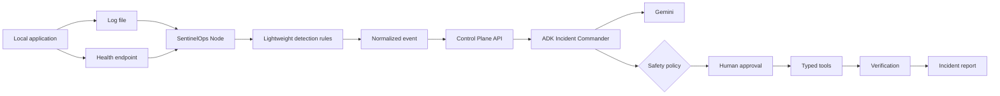

# SentinelOps

Autonomous AI incident commander for detecting, investigating, remediating, and verifying service incidents.

SentinelOps is being built for the **All Things Agentic Hackathon** in the **Taskmaster** category. The project uses Google Agent Development Kit (ADK), Gemini, and Google Cloud to run an event-driven incident-response workflow that takes action instead of only producing recommendations.

## Core workflow

`Detect -> Investigate -> Decide -> Remediate -> Verify -> Report`

A typical demo scenario is a faulty deployment that causes elevated HTTP 500 errors. SentinelOps receives the incident event, gathers logs and deployment context, correlates the failure with recent code changes, selects a safe remediation action, verifies recovery, and produces an incident timeline.

## SentinelOps architecture

SentinelOps consists of two logical parts:

1. **SentinelOps Control Plane** — FastAPI, Google ADK, Gemini, Cloud Run,
   Pub/Sub, Firestore, dashboard, policies, and incident orchestration.
2. **SentinelOps Node** — a lightweight local collector for log files,
   healthchecks, process state, heartbeats, and approved local actions.

The Node detects problems locally and sends only normalized trigger events with
bounded evidence to the Control Plane. It does not stream every log line to
Gemini.



## Planned architecture

- **FastAPI / Cloud Run** - incident webhook and API surface
- **Pub/Sub** - event ingestion and fan-out
- **Google ADK** - coordinator and specialized agents
- **Gemini 3.5 Flash** - reasoning, correlation, summarization, and decision support
- **Cloud Logging** - operational evidence
- **Firestore** - incident state, execution history, and memory
- **GitHub API** - commit, diff, repository, and pull-request context

Specialized agents:

- Incident Coordinator
- Log Analysis Agent
- Infrastructure Agent
- Code Analysis Agent
- Remediation Agent
- Verification Agent

## Safety model

SentinelOps uses permission-scoped tools and risk-aware action policies.

Low-risk operations such as reading logs, analyzing metrics, and running health checks can be autonomous. High-impact or destructive actions must be blocked or require explicit human approval.

## Repository status

This repository is an active hackathon build. It contains a deterministic local
demo workflow and a Google ADK live workflow behind the same API contract. The
demo mode is the safe default so development and judging rehearsals do not
consume Gemini credits or execute infrastructure changes.

## Implementation status

Implemented: local SentinelOps Node, log/health/process collectors, normalized
event ingestion, structured evidence, Node heartbeat registry, typed read-only
ADK tools, Safety Policy, unsupported remediation adapters, health-based
verification, local broken-service demo, and dashboard observability.

Planned: host-specific process/service restart adapters, production rollback
execution, and deeper Cloud Monitoring, Prometheus, Sentry, and Grafana
integrations. These remain behind the safety boundary until explicitly
configured.

## Requirements

- Python 3.11+
- Docker (optional, recommended for reproducibility)
- A Gemini API key or Vertex AI configuration
- Google Cloud project for Cloud Run / Pub/Sub / Firestore integration

## Local setup

### 1. Clone the repository

```bash
git clone https://github.com/EritikWoW/SentinelOps.git
cd SentinelOps
```

### 2. Create a virtual environment

Linux / macOS:

```bash
python3 -m venv .venv
source .venv/bin/activate
```

Windows PowerShell:

```powershell
py -m venv .venv
.\.venv\Scripts\Activate.ps1
```

### 3. Install dependencies

```bash
python -m pip install --upgrade pip
pip install -r requirements.txt
```

### 4. Configure environment variables

```bash
cp .env.example .env
```

On Windows:

```powershell
Copy-Item .env.example .env
```

For local development, keep the default offline mode:

```env
SENTINELOPS_MODE=demo
```

To use the real Google ADK coordinator after Gemini billing is available, set:

```env
SENTINELOPS_MODE=gemini
GEMINI_API_KEY=your_key_here
GEMINI_MODEL=gemini-3.5-flash
```

### 5. Run the API

```bash
uvicorn src.main:app --host 0.0.0.0 --port 8080 --reload
```

Then verify:

```bash
curl http://localhost:8080/health
```

Expected response:

```json
{"status":"ok","service":"sentinelops"}
```

## Docker reproducible test

Build:

```bash
docker build -t sentinelops .
```

Run:

```bash
docker run --rm -p 8080:8080 --env-file .env sentinelops
```

Verify:

```bash
curl http://localhost:8080/health
```

## Incident API smoke test

Start the API, then send a synthetic incident:

```bash
curl -X POST http://localhost:8080/incidents \
  -H "Content-Type: application/json" \
  -d '{"service":"demo-api","severity":"high","summary":"HTTP 500 rate exceeded threshold"}'
```

The endpoint runs the configured incident commander. In `demo` mode it produces
a deterministic six-stage run (`detect -> investigate -> decide -> remediate ->
verify -> report`) with a simulated remediation and timeline. In `gemini` mode
the same request is delegated to the Google ADK coordinator and specialist
agents. After approval, the demo exposes a safe local remediation action that
changes only the stored incident state; no production infrastructure is
mutated.

The local agent graph can also be inspected directly:

```powershell
.\.venv\Scripts\python.exe -c "from src.agents.adk_agent import build_root_agent; print(build_root_agent().name)"
```

Example demo response fields include `execution_mode`, `analysis.timeline`,
`analysis.remediation_status`, and `analysis.execution_notes`. This makes the
agent behavior observable without pretending that a rollback or restart really
changed infrastructure.

### Incident lifecycle endpoints

The local MVP stores analyzed incidents in an in-memory repository and exposes
the approval boundary used by the future Firestore-backed executor:

```text
POST /incidents                         create and analyze an incident
GET  /incidents?limit=25                 list recent incidents for observability
GET  /incidents/{incident_id}            retrieve the stored incident
POST /incidents/{incident_id}/approval   approve or reject remediation
POST /incidents/{incident_id}/execute    execute the safe demo action after approval
POST /incidents/{incident_id}/verify     record the post-action verification result
GET  /events                             inspect recent local workflow events
POST /events/{event_id}/replay           replay one local event with a new attempt id
POST /nodes/heartbeat                    register a SentinelOps Node heartbeat
GET  /nodes                              list Node liveness records
GET  /nodes/{node_id}                    inspect one Node
```

### SentinelOps Node (Phase 1)

The first Node implementation is a regular Python process and can later be
wrapped as a Windows Service, Linux daemon, or container. Start it with:

```powershell
python -m src.node.agent --config node.yaml
```

The current Node supports tail-style log rules, HTTP healthcheck failure
thresholds, process state checks, heartbeat reporting, and normalized event
submission. It does not execute production remediation yet. Typed remediation
adapters return explicit unsupported results when no host adapter is configured.
The Control Plane also exposes `POST /incidents/{incident_id}/verify/health` for
real post-action health verification; only a passing check marks an incident
resolved. The phase details are tracked in
[`docs/development-plan.md`](docs/development-plan.md).

The reproducible Node demo is documented in [`docs/node.md`](docs/node.md).
It starts a local broken service, triggers a real FATAL log and health failure,
and lets the Node create the incident automatically without a manual
`POST /incidents`.

The dashboard Workflow panel uses the incident history and event stream to
reopen prior analyses and inspect the latest local lifecycle events. History can
be searched by service, severity, or incident id and filtered by approval
status. Selecting an incident restores its approval state and keeps the
existing safety controls available for the next permitted step. Selecting an
event expands its JSON payload for debugging and demo observability.
The sidebar environment card also reads `/nodes` and shows the latest online
Node heartbeat when a Node is connected.

Approval example:

```powershell
$approval = @{ decision = "approve"; comment = "Approved for demo rehearsal." } | ConvertTo-Json
Invoke-RestMethod `
  -Uri http://127.0.0.1:8080/incidents/INCIDENT_ID/approval `
  -Method Post -ContentType "application/json" -Body $approval
```

An approval is recorded in the timeline. In demo mode, execution is explicit,
repeat-safe, and limited to local incident state; the store is intentionally isolated in `src/services/incident_store.py`
so it can be replaced by Firestore while preserving the API contract.

### Cloud persistence and events

The local defaults are deliberately safe:

```env
SENTINELOPS_STORE=memory
PUBSUB_ENABLED=false
```

For a restart-persistent offline development run, use the JSON store instead:

```env
SENTINELOPS_STORE=file
SENTINELOPS_DATA_FILE=.local-data/incidents.json
```

The JSON store uses atomic replacement on writes and is ignored by Git. It is
intended for local development; Firestore is the multi-instance backend.

For a Google Cloud deployment, configure the same service with:

```env
SENTINELOPS_STORE=firestore
PUBSUB_ENABLED=true
GOOGLE_CLOUD_PROJECT=sentinelops-505805
PUBSUB_TOPIC=sentinelops-incoming-events
PUBSUB_INTERNAL_TOPIC=sentinelops-internal-events
PUBSUB_SUBSCRIPTION=sentinelops-incoming-sub
SENTINELOPS_AUTH_REQUIRED=true
FIRESTORE_DATABASE=(default)
```

The application then persists incident documents in the `incidents` Firestore
collection and publishes `incident.created` and `incident.approval_decided`
and `incident.remediation_executed` messages to Pub/Sub. The Firestore and Pub/Sub clients are created only when
their backends are explicitly enabled, so local demo mode does not require
Google credentials.

When `SENTINELOPS_STORE=firestore`, Node records and event history are also
stored in the `nodes` and `events` collections. Inbound Pub/Sub is a separate
`EventConsumer` and is enabled only when both `PUBSUB_ENABLED=true` and
`PUBSUB_SUBSCRIPTION` are configured; the local `EventPublisher` does not imply
that inbound consumption is active.

### Dashboard

Open `http://127.0.0.1:8080/dashboard` after starting the API. The dashboard
shows the six-stage workflow, evidence, approval boundary, and the safe demo
action. The architecture diagram used for the hackathon submission is in
[`docs/architecture.md`](docs/architecture.md).
The implementation sequence and acceptance criteria are tracked in
[`docs/development-plan.md`](docs/development-plan.md).

The gear button opens the operational Settings panel. It reads the active
runtime configuration without exposing credentials and can persist only
non-secret values to `.env` (`SENTINELOPS_MODE`, model, store, Pub/Sub, Google
Cloud location, and environment). API keys are never returned by `GET /settings`
and are never rewritten by `POST /settings`. Backend changes intentionally take
effect after an API restart; the panel reports this explicitly. Human approval
remains enforced and live infrastructure mutation is disabled in this build.

## Cloud Run deployment

Once the Google Cloud project is configured:

```bash
gcloud auth login
gcloud config set project YOUR_PROJECT_ID
gcloud run deploy sentinelops --source . --region europe-west1
```

After deployment, record the generated `.run.app` URL for the Devpost hosted-project field and capture the Cloud Run dashboard/logs for the demo video.

The same flow is reproducible from Windows PowerShell:

```powershell
.\scripts\deploy-cloudrun.ps1 -ProjectId sentinelops-505805
.\scripts\smoke-cloudrun.ps1 -BaseUrl https://YOUR_SERVICE-REGION.a.run.app
.\scripts\verify-cloudrun.ps1 -ProjectId sentinelops-505805 -Service sentinelops -Region europe-west1
```

The deployment script intentionally starts in `demo` mode with the in-memory
store and Pub/Sub disabled. This gives a safe public demo first; Firestore and
Pub/Sub can be enabled later with a service account and explicit environment
configuration.

Before using Docker or gcloud, validate the cloud package locally:

```powershell
.\scripts\validate-cloud-config.ps1
```

Prepare the Google Cloud resources with an explicit two-step flow. The first
command is plan-only and does not change the project; add `-Apply` only after
reviewing the printed commands:

```powershell
.\scripts\bootstrap-gcp.ps1 -ProjectId sentinelops-505805 -CreateSecret
.\scripts\bootstrap-gcp.ps1 -ProjectId sentinelops-505805 -CreateSecret -Apply
```

The bootstrap creates/enables Firestore, Pub/Sub topic and subscription, a
dedicated Cloud Run service account, least-privilege runtime roles, and an
optional Secret Manager container. It never prints or uploads the Gemini key.

For a Gemini Cloud Run deployment, the script requires Secret Manager instead
of accepting an API key in command-line arguments:

```powershell
.\scripts\deploy-cloudrun.ps1 -ProjectId sentinelops-505805 -Mode gemini -UseSecretManager
```

Cloud Run probes can use `/health` for liveness and `/ready` for readiness.
After deployment, `verify-cloudrun.ps1` performs a read-only operational check
of the service URL, dedicated service account, health/readiness endpoints, safe
runtime settings, and Gemini secret wiring. It never prints the secret value.

## Reproducible testing checklist

A judge or reviewer should be able to validate the current scaffold with:

```bash
git clone https://github.com/EritikWoW/SentinelOps.git
cd SentinelOps
python3 -m venv .venv
source .venv/bin/activate
pip install -r requirements.txt
cp .env.example .env
uvicorn src.main:app --host 0.0.0.0 --port 8080
curl http://localhost:8080/health
```

Expected result: HTTP 200 with the SentinelOps health payload. The incident
smoke test should return HTTP 202 and `execution_mode: "demo"` without needing
an API key. Switch to `SENTINELOPS_MODE=gemini` only for a live Gemini run.

For the incident endpoint, use the smoke-test request shown above and verify that the API returns an accepted incident object and a generated incident id.

## Project structure

```text
SentinelOps/
├── README.md
├── .env.example
├── .gitignore
├── Dockerfile
├── .dockerignore
├── requirements.txt
├── docs/
│   └── architecture.md
├── scripts/
│   ├── deploy-cloudrun.ps1
│   └── smoke-cloudrun.ps1
├── src/
│   ├── main.py
│   ├── agents/
│   │   ├── adk_agent.py
│   │   ├── coordinator.py
│   │   ├── log_agent.py
│   │   ├── infrastructure_agent.py
│   │   ├── code_agent.py
│   │   ├── remediation_agent.py
│   │   └── verification_agent.py
│   └── models/
│       └── incident.py
└── tests/
    └── test_health.py
```

## Hackathon deliverables

- Working Gemini + ADK agent workflow
- Deterministic offline demo workflow
- Observable incident timeline and safe remediation status
- Google Cloud deployment
- Public source repository
- Reproducible README instructions
- Architecture diagram
- Approximately 4-minute demo video
- Live incident -> analysis -> remediation -> verification scenario
