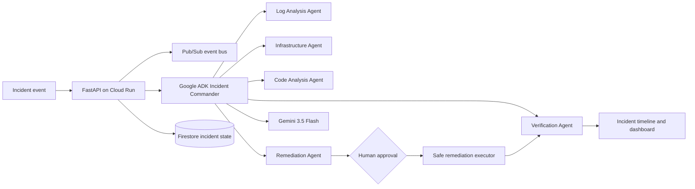

# SentinelOps architecture

The local demo uses the same API and agent contract with deterministic evidence.
Its remediation executor mutates only the local incident state. A production
executor remains behind the approval boundary and must be explicitly configured.
